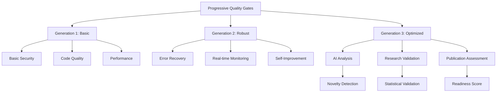

# Progressive Quality Gates Documentation

## Overview

The Progressive Quality Gates system represents a revolutionary approach to software quality validation, designed specifically for the Neural Operator Foundation Lab. This system evolves through three distinct generations, each building upon the previous to provide increasingly sophisticated quality assurance capabilities.

## 🚀 Key Features

### 🔄 Progressive Enhancement
- **Generation 1**: Basic functionality with core validation
- **Generation 2**: Robust error handling and monitoring  
- **Generation 3**: Optimized scaling and AI-powered analysis

### 🤖 Autonomous Operation
- Self-improving gates that learn from execution history
- Automatic error recovery and adaptation
- Intelligent orchestration of validation processes

### 🔬 Research-Specific Validation
- Experimental design validation
- Statistical methodology assessment
- Publication readiness evaluation
- AI-powered algorithmic novelty analysis

### 🛡️ Comprehensive Security
- Multi-layer security scanning
- Neural operator specific security patterns
- Dependency vulnerability detection
- Configuration security analysis

## Architecture



## Quick Start

### Basic Usage

```python
from neural_operator_lab.quality_gates import ProgressiveQualityGateSystem
from pathlib import Path

# Initialize system
system = ProgressiveQualityGateSystem(source_dir=Path("/path/to/project"))

# Run progressive validation
results = await system.execute_progressive_validation()

# Check results
if results['overall_passed']:
    print("✅ All quality gates passed!")
else:
    print("❌ Some quality gates failed")
```

### Command Line Interface

```bash
# Run all quality gates
python scripts/run_progressive_quality_gates.py

# Run specific mode
python scripts/run_progressive_quality_gates.py --mode security

# Enable research validation
python scripts/run_progressive_quality_gates.py --enable-research

# CI/CD mode
python scripts/run_progressive_quality_gates.py --ci-mode
```

## Generation Details

### Generation 1: Basic Functionality

**Focus**: Core validation with essential features

**Features**:
- Basic security pattern detection
- Standard code quality metrics
- Essential error handling
- Performance baseline checks

**Usage**:
```python
# Gates automatically start at Generation 1
gate = IntelligentSecurityGate()
result = await gate.execute_generation_1(context)
```

### Generation 2: Robust Monitoring

**Focus**: Enhanced reliability and monitoring

**Features**:
- Advanced error recovery strategies
- Real-time monitoring and alerting
- Comprehensive logging
- Self-improvement capabilities

**Usage**:
```python
# Autonomous validator with Generation 2 features
validator = AutonomousQualityValidator(source_dir)
results = await validator.run_autonomous_validation()
```

### Generation 3: Optimized Scaling

**Focus**: AI-powered analysis and research validation

**Features**:
- Distributed processing
- AI-powered security and code analysis
- Research quality validation
- Publication readiness assessment

**Usage**:
```python
# Full orchestration with Generation 3 capabilities
orchestrator = IntelligentQualityOrchestrator(source_dir)
results = await orchestrator.orchestrate_autonomous_validation()
```

## Security Validation

### Multi-Layer Security Scanning

The security system provides comprehensive validation across multiple layers:

1. **Static Code Analysis**
   - Pattern-based vulnerability detection
   - AST-based analysis for accuracy
   - False positive reduction algorithms

2. **Dependency Scanning**
   - Known vulnerability database
   - Version-specific vulnerability detection
   - Automated remediation suggestions

3. **Configuration Analysis**
   - Dockerfile security validation
   - Environment variable scanning
   - Configuration file analysis

### Neural Operator Security

Special security patterns for neural operator systems:

- **Model Security**: Unsafe model loading detection, pickle security
- **Data Privacy**: Sensitive data leakage prevention
- **Adversarial Robustness**: Model poisoning risk assessment
- **Supply Chain**: Model download verification

Example:
```python
security_gate = ComprehensiveSecurityGate()
context = {"source_dir": "/path/to/project"}
result = await security_gate.execute(context)

print(f"Security Score: {result.score}")
print(f"Vulnerabilities: {len(result.details['vulnerabilities'])}")
```

## Research Quality Validation

### Experimental Design Validation

Validates the quality of experimental design:

- **Baseline Comparisons**: Ensures adequate baseline methods
- **Statistical Power**: Analyzes sample sizes and effect sizes
- **Bias Detection**: Identifies potential experimental biases
- **Methodology Assessment**: AI-powered experimental design analysis

### AI-Powered Analysis

Advanced AI analysis capabilities:

- **Algorithmic Novelty**: Detects novel algorithmic patterns
- **Innovation Scoring**: Quantifies research contributions
- **Similarity Assessment**: Compares to existing approaches
- **Contribution Identification**: Identifies potential research contributions

### Publication Readiness

Comprehensive assessment for publication:

- **Code Quality**: Ensures publication-ready code standards
- **Documentation Completeness**: Validates comprehensive documentation
- **Experimental Rigor**: Assesses experimental methodology
- **Reproducibility**: Validates reproducibility measures
- **Statistical Validity**: Ensures proper statistical methods

Example:
```python
research_validator = ResearchQualityValidator(source_dir)
results = await research_validator.validate_research_quality()

pub_assessment = results['publication_assessment']
if pub_assessment.is_publication_ready:
    print("✅ Ready for publication!")
```

## Autonomous Features

### Self-Improving Gates

Gates that learn and improve over time:

```python
class CustomGate(SelfImprovingGate):
    async def _execute_generation_specific(self, context):
        # Your gate logic
        return QualityGateResult(...)

# Enable self-improvement
gate.self_improvement_enabled = True

# Gate automatically:
# - Handles errors with recovery
# - Monitors performance
# - Learns from patterns  
# - Improves algorithms
```

### Learning System

System-wide learning and evolution:

```python
learning_system = LearningQualitySystem(source_dir)
evolution_results = await learning_system.evolve_system()

print(f"System evolved to version: {evolution_results['system_version']}")
print(f"Changes applied: {len(evolution_results['evolution_changes'])}")
```

### Error Recovery

Advanced error handling with automatic recovery:

- **File Not Found**: Creates missing files or finds alternatives
- **Permission Errors**: Attempts permission fixes
- **Timeout Errors**: Implements exponential backoff retry
- **Memory Errors**: Reduces batch sizes and performs cleanup
- **Module Errors**: Attempts automatic package installation

## Monitoring and Alerting

### Real-Time Monitoring

```python
monitor = ComprehensiveMonitor()
monitor.start_monitoring()

# Configure alert thresholds
monitor.alert_thresholds = {
    'error_rate': 0.1,        # 10% error rate
    'avg_execution_time': 60.0, # 60 seconds
    'memory_usage': 0.8       # 80% memory usage
}

# Get monitoring report
report = monitor.get_monitoring_report()
```

### Performance Metrics

Comprehensive performance tracking:

- **Execution Count**: Total gate executions
- **Success Rate**: Percentage of successful executions
- **Average Execution Time**: Performance trends
- **Error Rate**: Failure rate monitoring
- **Resource Usage**: CPU, memory, disk usage

## CI/CD Integration

### GitHub Actions

```yaml
name: Progressive Quality Gates
on: [push, pull_request]

jobs:
  quality-validation:
    runs-on: ubuntu-latest
    steps:
    - uses: actions/checkout@v3
    - name: Set up Python
      uses: actions/setup-python@v4
      with:
        python-version: '3.9'
    - name: Install dependencies
      run: pip install -e .
    - name: Run Quality Gates
      run: python scripts/run_progressive_quality_gates.py --ci-mode
```

### Docker Integration

```dockerfile
FROM python:3.9-slim
WORKDIR /app
COPY . .
RUN pip install -e .

# Run quality gates during build
RUN python scripts/run_progressive_quality_gates.py --mode security

CMD ["python", "app.py"]
```

## Configuration

### Environment Variables

```bash
# Quality Gates Configuration
export QUALITY_GATES_LOG_LEVEL=INFO
export QUALITY_GATES_PARALLEL_WORKERS=4
export QUALITY_GATES_CACHE_ENABLED=true
export QUALITY_GATES_AI_CONFIDENCE_THRESHOLD=0.8
```

### Configuration File

```yaml
# quality_gates_config.yaml
system:
  log_level: INFO
  parallel_workers: 4
  cache_enabled: true

security:
  static_analysis_enabled: true
  dependency_scanning_enabled: true
  neural_operator_patterns_enabled: true

research:
  ai_analysis_enabled: true
  statistical_validation_enabled: true
  publication_readiness_enabled: true

monitoring:
  real_time_monitoring: true
  alert_thresholds:
    error_rate: 0.1
    execution_time: 30.0
    memory_usage: 0.8
```

## Best Practices

### 1. Progressive Implementation

Start with basic features and progressively enable advanced capabilities:

```python
# Phase 1: Basic validation
system = ProgressiveQualityGateSystem(source_dir)
basic_results = await system.execute_progressive_validation()

# Phase 2: Add autonomous features  
validator = AutonomousQualityValidator(source_dir)
autonomous_results = await validator.run_autonomous_validation()

# Phase 3: Enable research validation
research_validator = ResearchQualityValidator(source_dir)
research_results = await research_validator.validate_research_quality()
```

### 2. Security First

Always prioritize security validation:

```python
# Mandatory security check
security_gate = ComprehensiveSecurityGate()
security_result = await security_gate.execute(context)

if not security_result.passed:
    raise SecurityValidationError("Security validation failed")
```

### 3. Continuous Learning

Enable learning features for continuous improvement:

```python
# Enable self-improvement
for gate in system.gates:
    gate.self_improvement_enabled = True

# Enable system evolution
learning_system = LearningQualitySystem(source_dir)
```

### 4. Research Validation

For research projects, include comprehensive research validation:

```python
if is_research_project:
    research_results = await research_validator.validate_research_quality()
    
    if not research_results['publication_assessment'].is_publication_ready:
        print("Additional work needed for publication")
        for rec in research_results['publication_assessment'].recommendations:
            print(f"  • {rec}")
```

## Testing

### Unit Tests

```bash
# Run comprehensive tests
pytest tests/quality_gates/ -v --cov=neural_operator_lab.quality_gates

# Test specific components
pytest tests/quality_gates/test_progressive_gates.py -v
pytest tests/quality_gates/test_autonomous_validation.py -v
pytest tests/quality_gates/test_research_quality_gates.py -v
```

### Integration Tests

```bash
# Test full system integration
pytest tests/integration/test_quality_gates_integration.py -v
```

### Performance Tests

```bash
# Test system performance
pytest tests/performance/test_quality_gates_performance.py -v
```

## API Reference

### Core Classes

#### QualityGateResult
Enhanced result objects with generation tracking and detailed metrics.

#### AdaptiveQualityGate
Base class for quality gates that evolve through generations.

#### ProgressiveQualityGateSystem
Main system orchestrator for multi-generation validation.

#### IntelligentQualityOrchestrator
AI-powered orchestration with autonomous improvements.

### Autonomous Classes

#### AdvancedErrorHandler
Error handling with automatic recovery strategies.

#### ComprehensiveMonitor
Real-time monitoring with alerting capabilities.

#### SelfImprovingGate
Base class for gates that learn and improve over time.

#### AutonomousQualityValidator
Autonomous validation system with self-improvement.

### Research Classes

#### ResearchQualityValidator
Research-specific quality validation.

#### AIAnalysisEngine
AI-powered code and experimental analysis.

#### ExperimentalValidation
Statistical validation of experiments.

#### PublicationReadinessGate
Publication readiness assessment.

### Security Classes

#### ComprehensiveSecurityGate
Multi-layer security validation system.

#### StaticCodeAnalyzer
Advanced static code analysis with pattern detection.

#### DependencyScanner
Dependency vulnerability scanning and assessment.

## Troubleshooting

### Common Issues

1. **Import Errors**: Ensure package is installed with `pip install -e .`
2. **Permission Errors**: Check file and directory permissions
3. **Memory Issues**: Reduce parallel workers or enable memory optimization
4. **Timeout Errors**: Increase timeout values or enable distributed processing

### Debugging

Enable verbose logging for detailed debugging:

```python
import logging
logging.getLogger('neural_operator_lab.quality_gates').setLevel(logging.DEBUG)
```

### Performance Optimization

For large projects:

```python
# Increase parallel workers
system = ProgressiveQualityGateSystem(source_dir, max_workers=8)

# Enable caching
system.enable_caching = True

# Use distributed processing
processor = DistributedQualityProcessor(max_workers=16)
```

## Contributing

Contributions are welcome! Please see the [Contributing Guide](../CONTRIBUTING.md) for details.

### Development Setup

```bash
# Clone repository
git clone https://github.com/terragon-labs/neural-operator-foundation-lab.git
cd neural-operator-foundation-lab

# Install in development mode
pip install -e ".[dev]"

# Run tests
pytest tests/quality_gates/ -v
```

### Adding New Gates

```python
from neural_operator_lab.quality_gates import SelfImprovingGate

class MyCustomGate(SelfImprovingGate):
    def __init__(self):
        super().__init__("My Custom Gate", QualityGateGeneration.GENERATION_1)
    
    async def _execute_generation_specific(self, context):
        # Your validation logic
        return QualityGateResult(...)
```

## License

This project is licensed under the MIT License. See [LICENSE](../LICENSE) for details.

## Support

- **Documentation**: This guide and inline code documentation
- **Issues**: [GitHub Issues](https://github.com/terragon-labs/neural-operator-foundation-lab/issues)
- **Discussions**: [GitHub Discussions](https://github.com/terragon-labs/neural-operator-foundation-lab/discussions)

---

*Progressive Quality Gates - Revolutionizing software quality validation for neural operator research.*